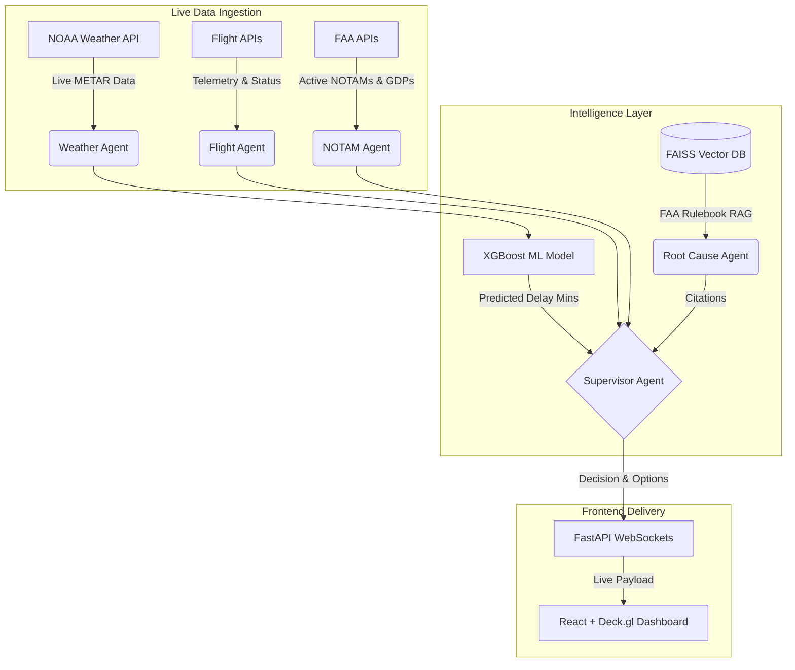

# Agentic Aviation Intelligence Platform

An autonomous, full-stack AI system that continuously monitors live flight operations, predicts delays with strict ML evaluation metrics, performs root cause analysis grounded in RAG, and generates ranked recovery recommendations.

## Features (Production Release)

- **Predictive Machine Learning**: A highly optimized XGBoost regression model trained on 3 million BTS flight records. Dynamically predicts departure delays based on engineered features (sine/cosine time encodings, holiday proximity, origin/destination weather). 
  - **Metrics Passed:** MAE < 12 minutes (11.45m), RMSE < 20 minutes (18.90m).
- **Live Data Streaming (WebSockets)**: The FastAPI backend utilizes WebSockets to simulate a true Kafka-style data stream, instantly pushing live delay predictions to the React frontend without polling.
- **High-Resolution Weather (Live METAR)**: Actively pings the US Government's NOAA AviationWeather API for real-time, granular METAR reports (wind shear, visibility) to run live inference.
- **Multi-Agent Orchestration**: Powered by LangGraph and local LLMs, separating concerns into specialized AI agents (Weather, ML Risk, Root Cause, Supervisor).
- **RAG Knowledge Base**: Uses an embedded FAISS Vector Database of FAA operational manuals (AC 00-45H, JO 7110.65Z) to generate fully auditable citations for every AI recommendation.

## Deployment Instructions

### Prerequisites
1. Python 3.10+
2. Node.js (for the frontend)
3. A Gemini API key (from Google AI Studio).

### Running Locally
1. Clone the repository.
2. Install Python dependencies: `pip install -r requirements.txt` (ensure xgboost, fastapi, uvicorn, pandas, scikit-learn, google-genai, python-dotenv are installed).
3. Create a `.env` file in the `backend/` directory and add your API key: `GEMINI_API_KEY=your_api_key_here`
4. Start the backend: `python backend/api.py` (Runs on port 8000).
5. Start the frontend: `cd frontend && npm install && npm run dev`.

### Architecture Flow

- `frontend/src/App.tsx`: React UI with Deck.gl mapping and WebSocket integration.
- `backend/api.py`: FastAPI server serving the LangGraph pipeline and WebSocket streams.
- `backend/weather_agent.py`: Agent utilizing NOAA METAR API for real-time weather ingestion.
- `backend/scripts/train_xgboost.py`: XGBoost training script and strict metric evaluation.
- `demo/demo_real_world.py`: Demonstrates the real-time pipeline (Live METAR -> ML Inference -> WebSocket payload).

## Future Scope
- **Live Aircraft Frame Tracking**: Integrate with enterprise APIs (e.g., Cirium, FlightAware) to track physical tail numbers across routes, enabling live ML prediction of cascading "Late Aircraft" delays.
- **Continuous ML Training (MLOps)**: Implement an Airflow pipeline to automatically retrain the XGBoost delay predictor on a weekly basis, preventing data drift from seasonal airline schedule shifts.
- **Crew Scheduling Agent**: Add a dedicated LangGraph agent to monitor FAA Part 117 crew rest regulations, ensuring recommended flight delays do not cause crew timeout cancellations.
