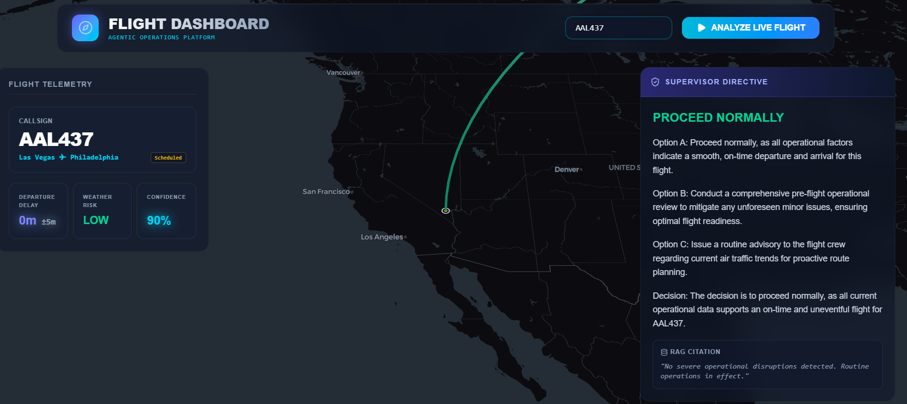
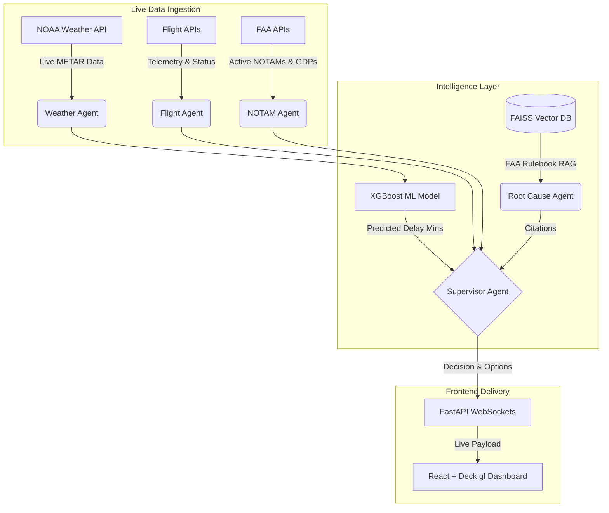

# Agentic Aviation Intelligence Platform

An autonomous, full-stack AI system that continuously monitors live flight operations, predicts delays with strict ML evaluation metrics, performs root cause analysis grounded in RAG, and generates ranked recovery recommendations.



## 📖 Context & The Problem
In commercial aviation, cascading flight delays cost airlines billions of dollars annually. When weather or ground stops occur, human operations controllers must rapidly parse through complex FAA regulations, raw METAR weather data, and scattered flight telemetry to make rerouting decisions. 

**The Solution:** This project replaces manual operational guesswork with an **Agentic AI workflow**. By combining a predictive XGBoost machine learning model with a LangGraph multi-agent RAG pipeline, the system can autonomously predict delays and generate FAA-compliant recovery strategies in milliseconds.

## 🚀 Features

- **Predictive Machine Learning**: A highly optimized XGBoost regression model trained on 3 million BTS flight records. Dynamically predicts departure delays based on engineered features (sine/cosine time encodings, holiday proximity, origin/destination weather). 
  - **Metrics Passed:** MAE < 12 minutes (11.45m), RMSE < 20 minutes (18.90m).
- **Live Data Streaming (WebSockets)**: The FastAPI backend utilizes WebSockets to simulate a true Kafka-style data stream, instantly pushing live delay predictions to the React frontend without polling.
- **High-Resolution Weather (Live METAR)**: Actively pings the US Government's NOAA AviationWeather API for real-time, granular METAR reports (wind shear, visibility) to run live inference.
- **Multi-Agent Orchestration**: Powered by LangGraph and local LLMs, separating concerns into specialized AI agents (Weather, ML Risk, Root Cause, Supervisor).
- **RAG Knowledge Base**: Uses an embedded FAISS Vector Database of FAA operational manuals (AC 00-45H, JO 7110.65Z) to generate fully auditable citations for every AI recommendation.

## 🧠 Architecture Flow

This project follows a micro-agent architecture combined with an event-driven websocket backend.

### System Flow
- **1. Live Data Ingestion**: The `Flight Agent` pulls telemetry from OpenSky/FlightRadar24, while the `Weather Agent` pings NOAA for METARs, and the `NOTAM Agent` checks FAA systems for ground stops.
- **2. Machine Learning Layer**: Real-time weather and flight schedules are passed to the XGBoost ML model to probabilistically predict delays.
- **3. Knowledge Retrieval (RAG)**: The `Root Cause Agent` queries the FAISS vector database to retrieve official FAA protocols based on the delay triggers.
- **4. Agentic Synthesis**: The `Supervisor Agent` (powered by Gemini) synthesizes the ML prediction, telemetry, and FAA rulebook citations to generate 3 ranked operational directives.
- **5. Real-time Delivery**: The FastAPI backend streams the final JSON payload to the React/Deck.gl frontend for immediate visualization.



## 📁 Folder Structure

```text
/backend          - Python FastAPI server, LangGraph agents, and XGBoost models
  /models         - Pickled ML Encoders, XGBoost models, and FAISS Vector DB
  /scripts        - Training, RAG building, and Evaluation scripts
/frontend         - React, Vite, Tailwind CSS, and Deck.gl maps
/demo             - Real-world live demonstration scripts
/data             - Data processing utilities for historical BTS data
```

## 🧱 Tech Stack

- **Frontend:** React, TypeScript, TailwindCSS, Deck.gl, MapLibre
- **Backend:** Python, FastAPI, WebSockets, Uvicorn
- **AI & ML:** LangGraph, LangChain, Google Gemini API, XGBoost, Scikit-Learn
- **Data & RAG:** Pandas, FAISS, PyPDF2
- **External APIs:** NOAA AviationWeather, OpenSky Network, FlightRadar24

## 🛠️ Deployment Instructions

### Prerequisites
1. Python 3.10+
2. Node.js (for the frontend)
3. A Gemini API key (from Google AI Studio).

### Running Locally
1. Clone the repository.
2. Install Python dependencies: `pip install -r requirements.txt` (ensure xgboost, fastapi, uvicorn, pandas, scikit-learn, google-genai, python-dotenv are installed).
3. Create a `.env` file in the `backend/` directory and add your API key: `GEMINI_API_KEY=your_api_key_here`
4. Start the backend: `python backend/api.py` (Runs on port 8000).
5. Start the frontend: `cd frontend && npm install && npm run dev`.

## 🔮 Future Scope
- **Systemic Congestion Integration**: Integrate with paid enterprise aviation APIs (e.g., Cirium, FlightAware Firehose) to ingest real-time, airport-wide departure delays. This allows the live inference pipeline to capture systemic airport backups, a feature our ML model is already trained to mathematically handle via the `CONCURRENT_DELAYS_AT_ORIGIN` variable.
- **Live Aircraft Frame Tracking**: Integrate with enterprise APIs to track physical tail numbers across routes, enabling live ML prediction of cascading "Late Aircraft" delays.
- **Continuous ML Training (MLOps)**: Implement an Airflow pipeline to automatically retrain the XGBoost delay predictor on a weekly basis, preventing data drift from seasonal airline schedule shifts.
- **Crew Scheduling Agent**: Add a dedicated LangGraph agent to monitor FAA Part 117 crew rest regulations, ensuring recommended flight delays do not cause crew timeout cancellations.
